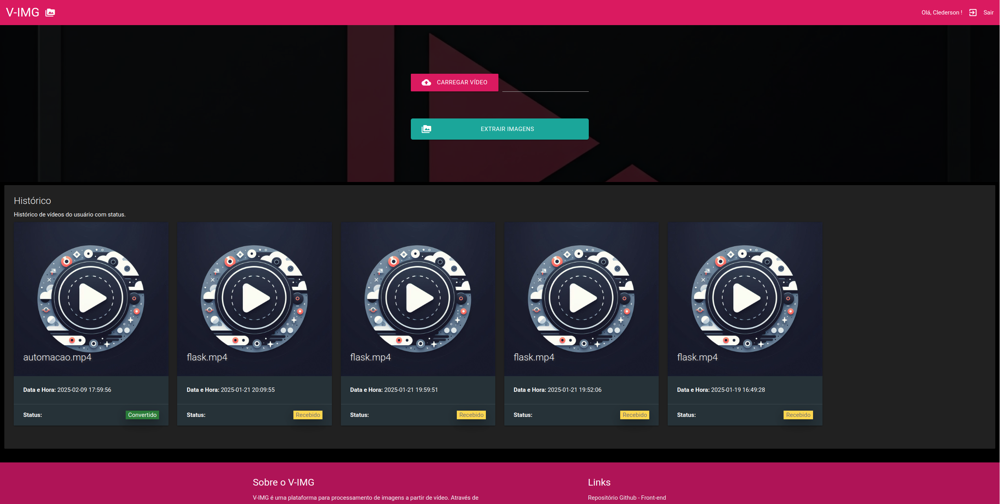
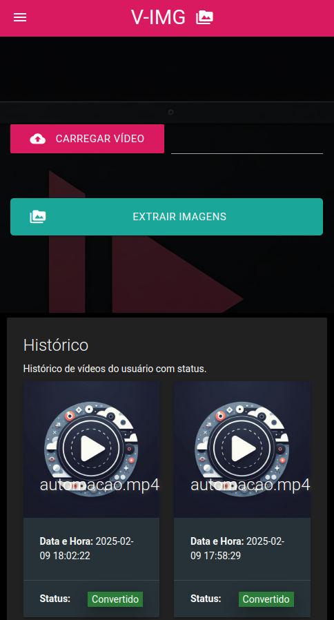
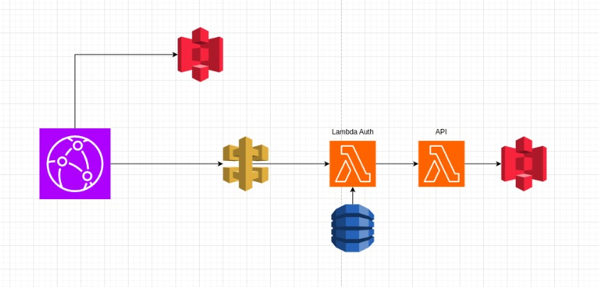

# Front-end para Processamento de Imagens

Este repositório contém o front-end da aplicação de multiprocessamento de vídeos da **FIAP X**. O sistema permite que os usuários façam upload de vídeos, acompanhem o status do processamento e façam o download dos arquivos gerados.

<p align="center">
	</img><br>
    <span>Interface do sistema - web</span>
</p>
<br>
<p align="center">
	</img><br>
    <span>Interface do sistema - mobile</span>
</p>

## Tecnologias Utilizadas

- **Python 3.13.1**
- **Flask** framework da aplicação
- **Flask-Login** para autenticação
- **SQLAlchemy** para comunicação com banco de dados
- **Materialize** para estilização
- **JavaScript (Fetch API)** para requisições assíncronas
- **Docker** para containerização

## Arquitetura

O front-end se comunica com a [**API de Processamento de Imagens**](https://github.com/6SOATGP54/hackathon-api) via chamadas REST. Ele foi projetado para ser simples e eficiente, funcionando dentro de um ambiente _serverless_ escalável.

<p align="center">
	</img><br>
    <span>Arquitetura Servless</span>
</p>

Os dados de imagens e vídeos podem ser armazenados em um S3, dentro da infraestrutura da AWS, respeitando a Lei Geral de Proteção de Dados (LGPD). Os dados dos usuários são armazenados no RDS Aurora.

## Funcionalidades

- Autenticação de usuários com Flask-Login.
- Upload de vídeos.
- Listagem do status dos vídeos processados.
- Download dos arquivos compactados.
- Notificação ao usuário em caso de falha no processamento.

## Instalação e Configuração

### Pré-requisitos

- Python 3.13.1 instalado
- Docker instalado (para ambiente de desenvolvimento)
- API de Processamento de Imagens em funcionamento

### Passos para rodar localmente

1. Clone o repositório:

   ```bash
   git clone https://github.com/6SOATGP54/hackathon-web
   cd hackathon-web
   ```

2. Crie e ative um ambiente virtual:

   ```bash
   python -m venv venv
   source venv/bin/activate  # Linux/Mac
   venv\Scripts\activate  # Windows
   ```

3. Instale as dependências:

   ```bash
   pip install -r requirements.txt
   ```

4. Configure as variáveis de ambiente no arquivo `.env`:

   ```env
   FLASK_APP=app.py
   FLASK_ENV=development
   SECRET_KEY=sua_chave_secreta
   API_URL=http://localhost:5000  # URL da API de Processamento de Imagens
   SQLALCHEMY_DATABASE_URI=string_do_banco_de_dados
   ```

5. Execute a aplicação:

   ```bash
   python run.py
   ```

## Estrutura do Projetos

O projeto segue princípios da arquitura em camadas, definindo e isolando responsabilidades com a aplicação de padrões de projeto que facilitam a manutenção e evolução do código para novas funcionalidades ou necessidades futuras.

```bash
vimg/
├── __init__.py
├── models.py    # modelos e entidades
├── routes.py    # rotas de controle
├── services.py  # serviços
├── static/      # arquivos estáticos
│   ├── css/
│   │   └── style.css
│   └── imgs/
│       ├── bg-body.jpeg
│       └── thumbnail.png
└── templates/  # páginas da aplicação
    ├── base.html
    ├── errors/
    │   ├── 401.html
    │   ├── 404.html
    │   ├── base.html
    │   └── generic.html
    ├── login.html
    ├── signup.html
    └── upload.html
```

## Testes

Para rodar os testes unitários:

```bash
python -m unittest discover tests
```

Para rodar os testes funcionais:
* Acesse [Testes Funcionais Automatizados do Sistema](https://github.com/6SOATGP54/hackathon-automated-tests) e siga o passo a passo para execução da esteira e geração de relatórios de teste.

## Segurança

Além do desenho de arquitetura, alguns detalhes de implementação tornam a aplicação robusta e segura ao mesmo tempo.
* Todas as senhas são criptogradas com Bcrypt
* As principais rotas da aplicação são restritas aos usuários autenticados
* As interações com o banco são intermediadas pelo ORM (SQLAlchemy)
* ...

## Contato

Grupo nº 54 da turma 6SOAT/2024 do curso lato sensu "Especialização em Arquitetura de Software" composto por:
- Bruno Matias
- Clederson Cruz
- Lucas Santiago
